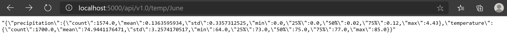
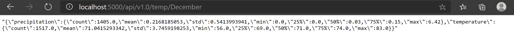

# surfs_up

##A. Background

Extracted temperature and precipitation data for island of **OHAHU** 
from 2010-01-01 to 2017-08-23.
Analyzed by month (June and Decmber) to see the  weather pattern and suitability 
of the weather for surfing/snack shop.

##B. Results

JUNE
|	|precipitation	|temperature
|count	|1574.000000	|1700.000000
|mean	|0.136360	|74.944118
|std	|0.335731	|3.257417
|min	|0.000000	|64.000000
|25%	|0.000000	|73.000000
|50%	|0.020000	|75.000000
|75%	|0.120000	|77.000000
|max	|4.430000	|85.000000

DECEMBER
	precipitation	temperature
count	1405.000000	1517.000000
mean	0.216819	71.041529
std	0.541399	3.745920
min	0.000000	56.000000
25%	0.000000	69.000000
50%	0.030000	71.000000
75%	0.150000	74.000000
max	6.420000	83.000000

##C. Observation

1. From the tables above december is wetter and cooler 
in the island of OHAHU compared to the month of June
2. Standard deviation for temperature is a lot smaller , 
indicating the temperature flucutuations are smaller. 
Seems the range is about 11 deg F for each month
3. Precipitation is almost 60% higher in decmber compared
to June gthroughout the 7 years.
4. Variation in precipaitation for each month is a lot, 
especially for both months june and december  have somedays 
that are very wet but from the quartiles, the number of days 
is probably small. i.e the number of days the business could be slow.

##D. Recommendation for further Analysis

1. Look at data by station to see if there are discrpency due to some stations 
reporting erroneous data, filter them out if necessary

2. Analyze by station to see if there are locations in OHAHU
that is better to set up shop

3. Analyze data for the school holiday months, e,g spring break in march,
summer months June,July and August, december break December and in particular 
the last two weeks in december/1 week in January.

